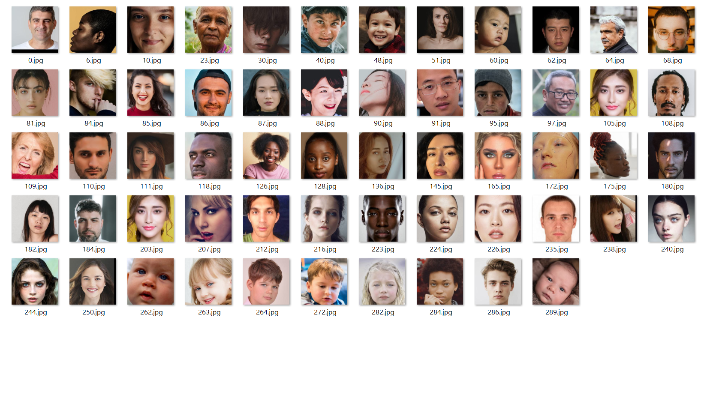
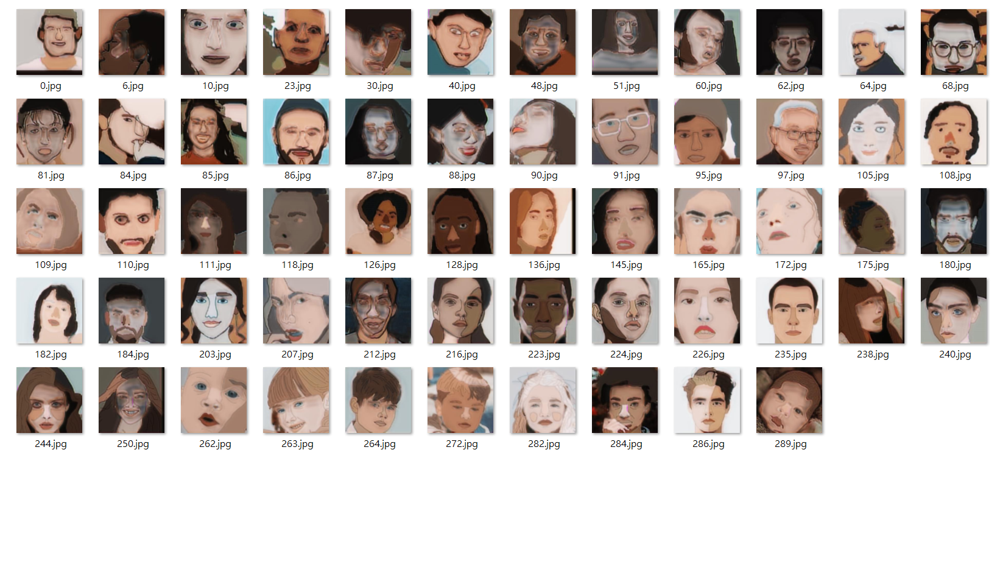

# pix2pix-pytorch

PyTorch implementation of [Image-to-Image Translation Using Conditional Adversarial Networks](https://arxiv.org/pdf/1611.07004v1.pdf).

Based on [pix2pix](https://phillipi.github.io/pix2pix/) by [Phillip Isola](https://github.com/phillipi) et al.

## Prerequisites

+ Linux
+ Python, Numpy, PIL
+ pytorch 0.4.0
+ torchvision 0.2.1

## Getting Started

+ Clone this repo
+ Create 'dataset/portrait_shuffle/train/'
+ Create 'dataset/portrait_shuffle/new_test/'
+ Put training set and test set into train/test folder
+ Train the model:

    python train.py

+ Test the model:

    python test.py
+ Test PSNR & SSIM

    python psnr_ssim.py
## Acknowledgments

This code is a reference of [pix2pix](https://phillipi.github.io/pix2pix/).

Highly recommend the more sophisticated and organized code [pytorch-CycleGAN-and-pix2pix](https://github.com/junyanz/pytorch-CycleGAN-and-pix2pix).

##
